# About
This project is an implementation of a basic DCGAN (see [paper](https://arxiv.org/abs/1511.06434) and [code](https://github.com/Zeleni9/pytorch-wgan/)) trained with a Wasserstein objective function (see [paper](https://arxiv.org/abs/1701.07875) and [code](https://github.com/martinarjovsky/WassersteinGAN)).

# Getting Started

Note:  the default device is `cpu`, but any valid pytorch device string may be
specified with the `--device` option (ie. `--device cuda:0`).  See [this](https://pytorch.org/docs/stable/tensor_attributes.html#torch.device) for more information on devices.

## Install the requirements
`python3 -m pip install -r requirements.txt`

## Download the pretrained weights
`python3 get_checkpoints.py`

## Sample from a model
`python3 gan.py --config cat-faces --checkpoint checkpoints/cat_faces_pretrained.pt --sample 8 --temp 1`

## Train a model

### Download desired datasets
 - Cat Faces - Download from [here](https://www.kaggle.com/datasets/spandan2/cats-faces-64x64-for-generative-models), extract the files, and place `cats/` directory in `~/datasets/cat_faces/` directory like so:  `~/datasets/cat_faces/cats/[IMG].jpg`.

### Train from scratch
`python3 gan.py --config cat-faces --train --batch-size 64`

### Train from a checkpoint
`python3 gan.py --config cat-faces --checkpoint checkpoints/cat_faces_pretrained.pt --train --batch-size 64`

# Full options list
```
./gan.py --help
usage: gan.py [-h] [-t] [-l LEARNING_RATE] [-e EPOCHS] [-n BATCH_SIZE] [-d DEVICE] [--checkpoint CHECKPOINT]
              [--config CONFIG] [--sample SAMPLE] [--temperature TEMPERATURE]

Perform GAN experiments

options:
  -h, --help            show this help message and exit
  -t, --train           train the model
  -l LEARNING_RATE, --learning-rate LEARNING_RATE
                        learning rate
  -e EPOCHS, --epochs EPOCHS
                        number of training epochs
  -n BATCH_SIZE, --batch-size BATCH_SIZE
                        batch size
  -d DEVICE, --device DEVICE
                        torch device string
  --checkpoint CHECKPOINT
  --config CONFIG
  --sample SAMPLE       number of samples
  --temperature TEMPERATURE
                        temperature of samples
```

# Unit tests
Unit tests can be run from the project root by using the command
`python3 -m unittest`

# Sampled images
Note:  Temperature controls the fraction of the trained standard deviation to use when sampling.

Temperature 1.5

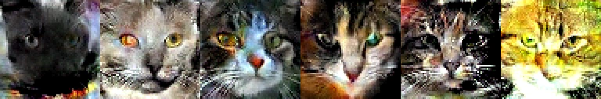  
<br>
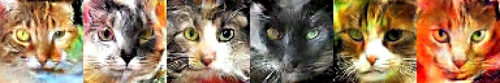

Temperature 1.0

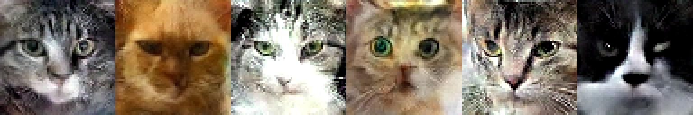

Temperature 0.8

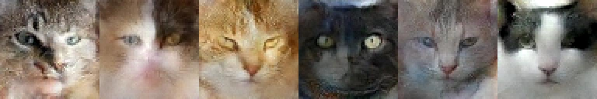

Temperature 0.6

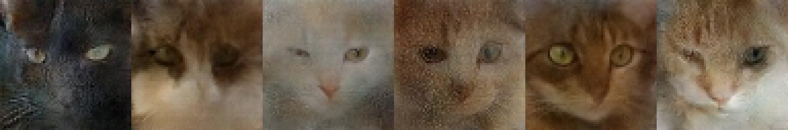

Temperature 0.4

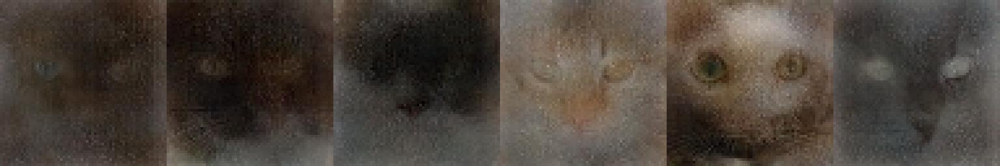

# Training progress
Epoch 16

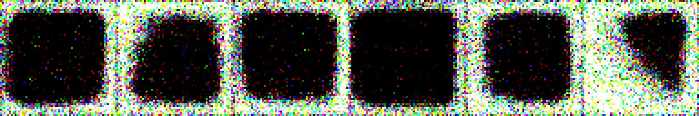

Epoch 32

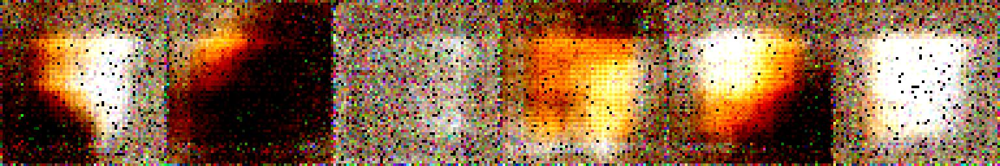

Epoch 64

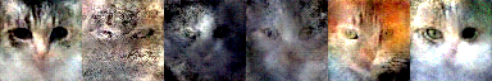

Epoch 128

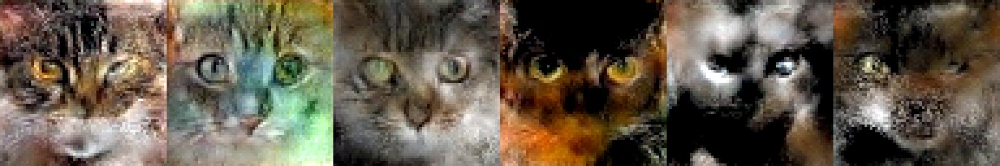

Epoch 256

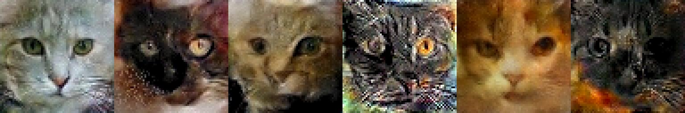

Epoch 512

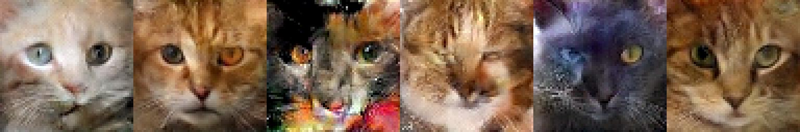

Epoch 800

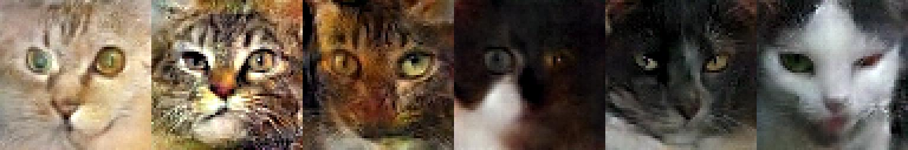


## Model Overview
The GAN model consists of a generator, a discriminator, and a reconstruction network.

### Generator
The generator consists of a series of strided transposed convolutions which upsample a random sample drawn from a unit Normal distributuion.  Each transposed covolution is accompanied by a batch normalization layer and a ReLU non-linearity.  The output of the transposed convolutions is fed to a reconstruction network.  The reconstruction network is a mixture of 10 logistic distributions.  See the `VDVAE` project for a full description of the discetized mix of logistics.

### Discriminator
The discriminator consists of a series of strided convolutions which downsample an input image at each layer.  The major difference between a basic GAN and the Wasserstein GAN is the discriminator output.  A basic GAN classifies the input as "real" or "fake," which can be done through a Cross Entropy loss.  When using a CE loss, the model outputs are passed through a softmax function to convert the raw model class scores to a proper per-class probability.  In a Wasserstein GAN, the final output is a single scaler which is trained to rate the quality of an input.  Instead of a per-class probability, the model provides a unitless and boundless scaler where higher numbers indicate a sample is more likely real.  To train the discriminator, the difference between the real sample scores and the fake sample scores is maximized.

$`f_D = discriminator(batch_{real}) - discriminator(batch_{fake})`$

By maximizing this objective function, the discriminator should learn to differentiate between real and fake images.  The Generator objective function is simply to maximize the discriminator's score of the fake samples.

$`f_G = discriminator(generator())`$

As the generator trains to maximize the discriminator score of random samples, it also minimizes the discriminator's objective function.  Similarly, as the discriminator trains to maximize it's objective function, this is at odds with the generator's objective function.  This can be viewed in a game theoretic manner as a zero sum game.  Each component of the model attempts to maximize their objective to the detriment of the other component.  The purpose of the Wasserstein objectives are to stabilize training through more linear gradients.  When using a traditional classifying discriminator, the transition between real/fake is abrupt, and when classified as real there is the problem of vanishing gradients when the generator may still be far from optimal.  It's possible there could be some oscillation between iterations which could then destabilize training.  Referencing figure 2 from Arjovsky et al., when a generated sample is classified as real there is very little incentive to continue to improve due to the vanishing gradients, whereas the WGAN objective continues to provide a learning signal.


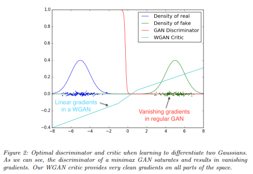


Something to note is that the generator performance is intrinsically linked to the discriminator performance.  Stated differently, if the discriminator is not very good at differentiating real and fake images, the generator does not have to be very good at generating likely images to maximize it's objective function.  In much of the theoretical justification for GANs, it's assumed that an optimal discriminator is available (Murphy).  In this scenario the parameters of the discriminator are fixed and the generator parameters continuosly improve to better model the target distribution.  However, GANs are trained with randomly initialized discriminators.  While the model components will always seek to maximize their objectives, they may do so by learning feature representations which we don't actually care about.  If the generator can trick the discriminator simply by using a particular color balance or primitive shape, there will be no need to learn higher order representations.  This is known as mode collapse, where a generator generates a very narrow range of output which does not properly represent the dataset.  If the discriminator is able to learn a particular generator "trick," there is still a danger of mode hopping where the discriminator learns a particular type of generator output, the generator learns a new one, and then the discriminator simultaneously learns the new type of generator output while forgetting the previous.  Using the prior example a GAN suffering from mode hopping would alternate endlessly between generating primitive shapes and generating certain color balances.  Mode hopping was observed during this project when initially using a Cross Entropy loss.  To approximate the theoretical scenario where an optimum discriminator is available, many implemenatations update the discriminator more often than the generator (this project uses a common ratio of 5:1).

Even with the WGAN objective function, there was some training instability as the objective function and sample quality oscillated during the later stages of training.  During the early stages of training some moderate swings in performance can be expected as the optimizer moves through various local minimia.  These swings should generally decrease in magnitude and the objective should stabilize.  However, the later stages of training would see the objective EMA stabilize for a few epochs and then suddenly jump by a factor of 2-3.  Just as the model appeared to be converging, the objective and sample quality would deteriorate.

A likely contributing factor was the small size of the dataset.  The dataset consists of ~16k 64 x 64 images of cat faces.  Additionally, there were some examples of poor lighting and non-unique cats (like GANs, cats are also hard to train):

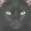
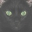
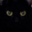

Initially, some data augmentation was applied to offset the small dataset size.  The torchvision color jitter and random horizontal flip transforms were applied during training.  These seemed to provide a modest benefit to sample quality, but did not seem to stabilize the later stages of trainging.  The size of the latent encoding generator input was increased from the original DCGAN value of 100 to 512.  This stabilized the late stages of training and permitted non-subjective determination of convergence based on the objective function value.  With a latent encoding ~5x larger each individual value contributes less to the generator output, so the generator becomes more robust to extreme values in the latenent encoding.  This is supported by the temperature 1.5 samples above.  Using a size 100 latent vector, samples with a temperature higher than 1.0 would lose coherence.  However, with the 512 sized latent the samples retain coherence.  The temperature 1.5 images are qualitatively "spicier" as well.  They generally have more distinctive features and more extreme color balances.  Samples retaining coherence above a temperature of 1.5 is somewhat surprising.  The generator was trained with unit Normal latent vectors, so it's surprising that the generator is robust to a latent vector scaling of 1.5.  Again, this is attributed to individual values having less effect with a larger latent vector size.


References:

Murphy, K.  (2023).  Probabilistic Machine Learning:  Advanced Topics.  Section 26.3.2, p. 860.  Retrieved from https://probml.github.io/pml-book/book2.html


Arjovsky, M., Chintala, S., Bottou, L.  (2017).  Wasserstein GAN.  Retrieved from https://arxiv.org/abs/1701.07875
